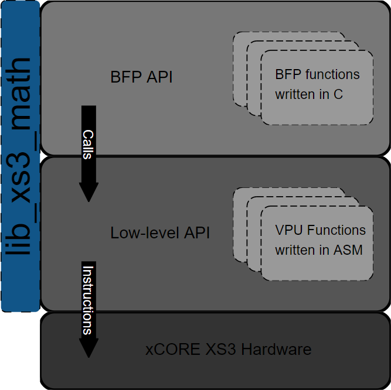

.. _getting_started:

Getting Started
===============

Overview
--------

``lib_xs3_math`` has a two layer API model. The upper layer is a block floating-point (BFP) API in which many details of operations being performed are hidden from the user. The lower layer, called the `low-level API`, stays much closer to the metal and requires that some care be taken to avoid conditions like arithmetic saturation or underflow. The BFP API calls the low-level API, which is where the bulk of the work is actually performed.




BFP API
-------

In the high-level API the BFP vectors C structures such as ``bfp_s16_t``, ``bfp_s32_t``, or ``bfp_complex_s32_t``, backed by a memory buffer. These objects contain a pointer to the data carrying the content (mantissas) of the vector, as well as information about the length, headroom and exponent of the BFP vector.

Below is the definition of :c:struct:`bfp_s32_t` from xs3_math_types.h.

.. @snippet{lineno} api/xs3_math_types.h bfp_s32_t 

.. code-block:: c

    C_TYPE
    typedef struct {
        /** Pointer to the underlying element buffer.*/
        int32_t* data;
        /** Exponent associated with the vector. */
        exponent_t exp;
        /** Current headroom in the ``data[]`` */
        headroom_t hr;
        /** Current size of ``data[]``, expressed in elements */
        unsigned length;
        /** BFP vector flags. Users should not normally modify these manually. */
        bfp_flags_e flags;
    } bfp_s32_t;

The functions in :ref:`bfp_32bit` take :c:struct:`bfp_s32_t` references as input and output parameters.

Functions in the BFP API generally are prefixed with ``bfp_``.

Initializing BFP Vectors
````````````````````````

Before calling these functions, the BFP vectors represented by the arguments must be initialized. For :c:struct:`bfp_s32_t` this 
is accomplished with :c:func:`bfp_s32_init()`.

.. code-block:: c

    #define LEN (20)

    //The object representing the BFP vector
    bfp_s32_t bfp_vect; 

    // buffer backing bfp_vect
    int32_t data_buffer[LEN]; 
    for(int i = 0; i < LEN; i++) data_buffer[i] = i;

    // The initial exponent associated with bfp_vect
    exponent_t initial_exponent = 0; 

    // If non-zero, ``bfp_s32_init()`` will compute the headroom currently present in data_buffer. 
    // Otherwise, headroom is initialized to 0 (which is always safe but may not be optimal)
    unsigned calculate_headroom = 1; 

    // Initialize the vector object
    bfp_s32_init(&bfp_vec, data_buffer, initial_exponent, LEN, calculate_headroom);

    // Go do stuff with bfp_vect
    ...


Once initialized, the exponent and mantissas of the vector can be accessed by ``bfp_vect->exp`` and ``bfp_vect->data[]`` respectively, with the logical (floating-point) value of element ``k`` being given by ``ldexp(bfp_vect->data[k], bfp_vect->exp)``.

BFP Arithmetic Functions
````````````````````````

The following snippet shows a function ``foo()`` which takes 3 BFP vectors, ``a``, ``b`` and ``c``, as arguments. It multiplies together ``a`` and ``b`` element-wise, and then subtracts ``c`` from the product. In this example both operations are performed in-place on ``a``. (See :c:func:`bfp_s32_mul()` and :c:func:`bfp_s32_sub()` for more information about those functions)

.. code-block:: c

    void foo(bfp_s32_t* a, const bfp_s32_t* b, const bfp_s32_t* c)
    {
        // Multiply together a and b, updating a with the result.
        bfp_s32_mul(a, a, b);

        // Subtract c from the product, again updating a with the result.
        bfp_s32_sub(a, a, c);
    }


The caller of ``foo()`` can then access the results through ``a``. Note that the pointer ``a->data`` was not modified during this call.

Low-level API
-------------

The functions in the low-level API are optimized for performance. They do very little to protect the user from mangling their data by arithmetic saturation/overflows or underflows. Functions in the low-level API are generally prefixed with ``xs3_``.

As an example of a function from the low-level API, see :c:func:`xs3_vect_s32_mul()` from ``xs3_vect_s32.h``, which multiplies together two ``int32_t`` vectors element by element.

.. @snippet{lineno} api/vect/xs3_vect_s32.h xs3_vect_s32_mul

.. code-block:: c

    C_API
    headroom_t xs3_vect_s32_mul(
        int32_t a[],
        const int32_t b[],
        const int32_t c[],
        const unsigned length,
        const right_shift_t b_shr,
        const right_shift_t c_shr);

This function takes two ``int32_t`` arrays, ``b`` and ``c``, as inputs and one ``int32_t`` array, ``a``, as output. ``length`` indicates the number of elements in each array. The final two parameters, ``b_shr`` and ``c_shr``, are the arithmetic right-shifts applied to each element of ``b`` and ``c`` before they are multiplied together.

Why the right-shifts? This reflects details of the XS3 instructions which target the VPU. With the XS3 VPU, multiplications of 32-bit numbers always include a compulsory (rounding) right-shift by 30 bits. So, to multiply two vectors element-wise with managed precision, the inputs must be shifted before multiplication to ensure the results are scaled as desired.

Contrast this with :c:func:`xs3_vect_s16_mul()`:

.. @snippet{lineno} api/vect/xs3_vect_s16.h xs3_vect_s16_mul

.. code-block:: c

    C_API
    headroom_t xs3_vect_s16_mul(
        int16_t a[],
        const int16_t b[],
        const int16_t c[],
        const unsigned length,
        const right_shift_t a_shr);

The parameters are similar here, but instead of ``b_shr`` and ``c_shr``, there's only an ``a_shr``. This reflects the fact that products of 16-bit numbers can be accumulated without a compulsory right-shift, and so there is no risk of losing information by multiplying. Instead, a single right-shift can be applied to the 32-bit product to correctly scale theresult.

Both :c:func:`xs3_vect_s32_mul()` and :c:func:`xs3_vect_s16_mul()` return the headroom of the output vector ``a``.

Functions in the low-level API are in many cases closely tied to the instruction set architecture for XS3. As such, when more efficient algorithms are found to perform an operation these functions are more likely to change.